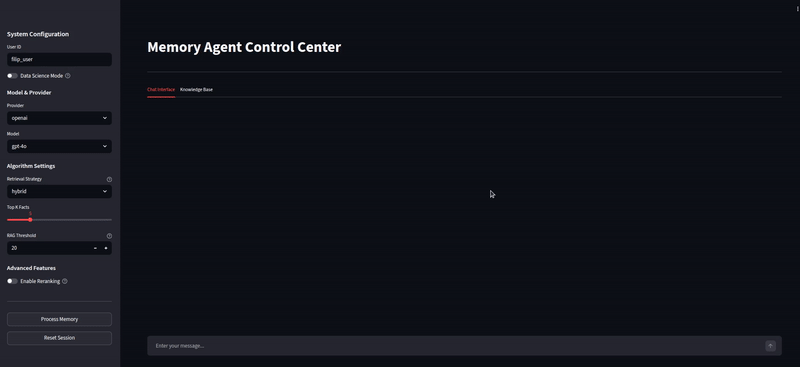
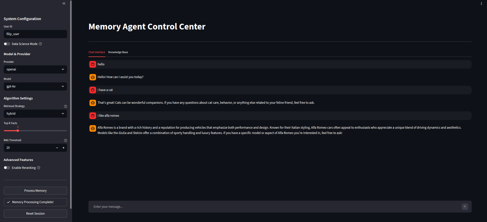
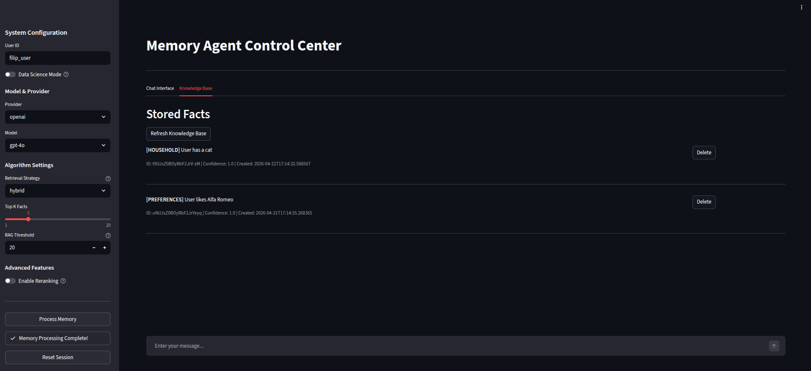
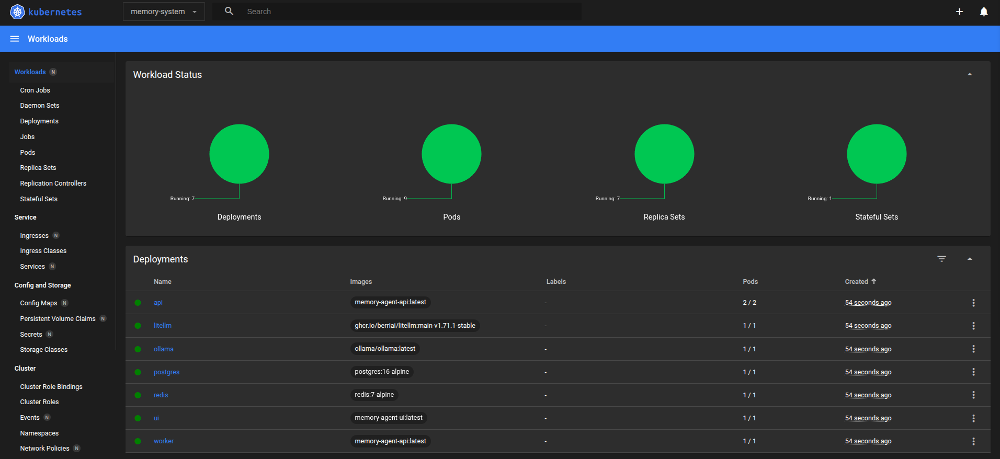
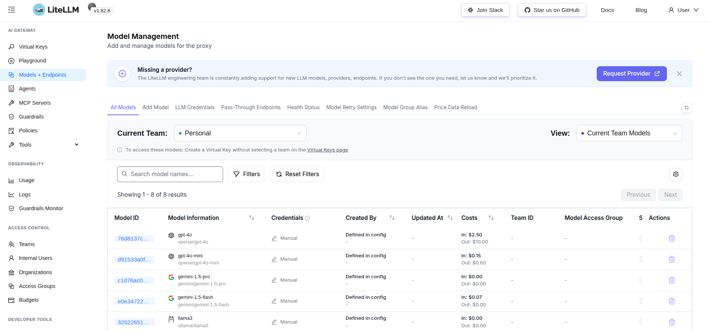
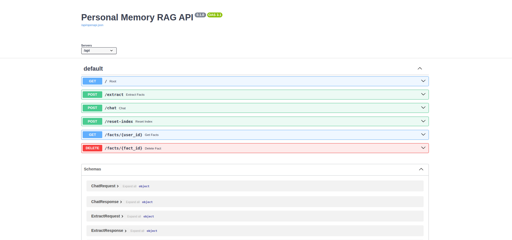
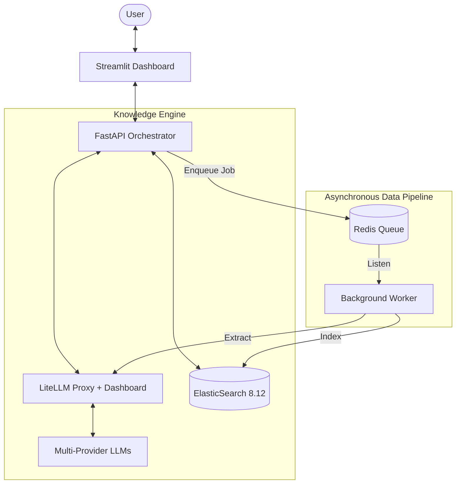

# Personal Memory Module

A professional, high-performance RAG (Retrieval-Augmented Generation) system designed to extract atomic facts from conversations and manage a persistent, searchable "User Memory."

<p align="center">
  
  <br>
  <em>High-performance async fact extraction and real-time profile management.</em>
</p>

---

## Quick Access & Dashboards

Access your specialized interfaces across environments using the links below.

| Service | Local (Docker) | Kubernetes (Minikube) |
| :--- | :--- | :--- |
| **Streamlit UI** | [localhost:8501](http://localhost:8501) | [memory.local](http://memory.local) |
| **LiteLLM Dashboard** | [localhost:4000](http://localhost:4000) | [litellm.local](http://litellm.local) |
| **API Documentation** | [localhost:8000/api](http://localhost:8000/api) | [memory.local/api](http://memory.local/api) |
| **Cluster Dashboard** | N/A | `minikube dashboard` |

---

## Professional Interface Gallery

### Modern Chat Interface
A premium Streamlit-based dashboard allowing real-time interaction with the Memory Engine. It features "Data Science Mode" for deep retrieval tracing.

<p align="center">
  
  <br>
  <em>Figure 1: Main interactive dashboard featuring RRF-based Hybrid Search controls.</em>
</p>

### Knowledge Base Manager
View, search, and manage extracted facts stored in ElasticSearch. Supports manual deletions and bulk refreshes.

<p align="center">
  
  <br>
  <em>Figure 2: Managed Knowledge Store showing atomic fact extraction results.</em>
</p>

### Knowledge Verification
Close-up view of the fact verification and profile management system.

<p align="center">
  
  <br>
  <em>Figure 3: Intelligent profile pruning and verification interface.</em>
</p>

### LiteLLM Observability & Tracing
Centralized dashboard for monitoring LLM interactions, latencies, and detailed request/response tracing.

<p align="center">
  
  <br>
  <em>Figure 4: LiteLLM observability dashboard showing latency and cost telemetry.</em>
</p>

### API & Observability
Full OpenAPI/Swagger documentation for direct system integration and a centralized LiteLLM dashboard for model health and cost tracking.

<p align="center">
  
  <br>
  <em>Figure 5: Enterprise-ready OpenAPI documentation for the Memory Engine.</em>
</p>

---

## System Overview

This project implements a complete **Asynchronous RAG Pipeline**:
1. **Extraction**: Facts are extracted from raw logs using LLM-based atomic fact identification.
2. **Indexing**: Facts are stored in **ElasticSearch** using a Hybrid approach (KNN Vector + BM25 Keyword).
3. **Retrieval**: Real-time context injection using **Reciprocal Rank Fusion (RRF)** to blend semantic and keyword relevance.
4. **Orchestration**: Managed via **LiteLLM** for multi-provider stability (OpenAI, Gemini, Ollama).

---

## Data Safety & PII Filtering

The system is architected with a **Privacy-First** mindset. It is deeply aware of sensitive information and implements a **Dual-Layer Defense** to prevent the leakage of Personally Identifiable Information (PII) into long-term memory:

1. **LLM Instruction Layer**: The extraction prompt is strictly tuned to ignore sensitive data during the initial identification phase.
2. **Hard-Validation Layer**: Every extracted fact passes through a rigorous Pydantic-based regex filter. If a fact contains PII, the system **automatically blocks it** before it ever reaches ElasticSearch.

**Supported Safety Filters:**
- **National IDs**: Automatic detection of formats like PESEL (Poland).
- **Financial Data**: Hardened IBAN and Credit Card number filtering.
- **Precise Locations**: Blocks street-level addresses while allowing city-level contextual memory.

---

## Installation & Commands

### Quick Help
Run the help command to see all available lifecycle and deployment tasks:
```bash
make help
```

### Local Development (Docker)
Start the full stack (API, UI, Redis, ES) with a single command:
```bash
make dev-up
```

### Kubernetes Deployment (Production-Ready)
Deploy the stabilized stack to Minikube:
1. Full Build & Deploy: `make k8s-rebuild-all`
2. Network Access: `make k8s-tunnel` (Keep open)
3. Local DSN: `make k8s-hosts`

---

## Environment Configuration

The system uses a centralized `.env` file to manage secrets across both Docker and Kubernetes. Refer to `.env.example` for the full template.

| Variable | Description | Default |
| :--- | :--- | :--- |
| `OPENAI_API_KEY` | Your OpenAI API Key | `None` |
| `GEMINI_API_KEY` | Your Google Gemini API Key | `None` |
| `LITELLM_MASTER_KEY` | Secret key for LiteLLM Proxy access | `sk-1234` |
| `LITELLM_MODE` | Toggle `DEV` or `PRODUCTION` dashboard | `PRODUCTION` |
| `UI_USERNAME` | Admin login for LiteLLM/Streamlit | `admin` |
| `UI_PASSWORD` | Admin password for LiteLLM/Streamlit | `admin1234` |

*Note: In Kubernetes, these are automatically injected via the `memory-secrets` generator.*

---

## Kubernetes Orchestration

The project includes a comprehensive Kubernetes manifest suite managed via Kustomize. It is optimized for the Minikube ecosystem and local development observability.

### Cluster Components
- Ingress-NGINX: Handles unified routing across the UI, API, and LiteLLM services.
- Persistent Volumes (PVC): Ensures ElasticSearch data and Ollama models survive pod restarts.
- Secret Management: Encrypted credentials for model providers (OpenAI, Gemini).
- InitContainers: Implemented in LiteLLM and Worker pods to ensure database readiness before startup.

### Advanced K8s Commands
- Live Monitoring: `make k8s-watch`
- Hostname Routing: `make k8s-hosts` to enable professional `litellm.local` dashboard access.
- Image Synchronization: `make k8s-fix-images` to rebuild images directly inside the Minikube Docker daemon.

---

## CLI Usage

The project includes a robust CLI for bulk processing of historical conversation logs.

### Bulk Fact Extraction
Run the extraction pipeline on a directory of JSON conversation files:
```bash
poetry run task-1-extract-facts --input ./example_conversations --provider gemini
```

**Available Options:**
- `--input / -i`: Folder containing conversation logs (Default: `./example_conversations`).
- `--output / -o`: Folder for result manifests (Default: `./outputs`).
- `--provider / -p`: LLM Provider (`gemini` or `openai`).
- `--model / -m`: Model override (e.g. `gpt-4o`).
- `--delay / -d`: Seconds to wait between API calls to respect rate limits.

---

## Adaptive RAG Settings

The dashboard includes a **Data Science Mode** for real-time algorithm tuning:

1. **Hybrid Alpha (0.0 - 1.0)**:
   - **1.0 (Pure Vector)**: Semantic similarity.
   - **0.0 (Pure Keyword)**: Exact text matching.
   - **0.5 (Balanced)**: Uses RRF to blend results.
2. **Top K Facts**: Determines context injection depth (Recommended: 5-8).
3. **RAG Threshold**: Intelligent profile injection logic.
4. **Model Reranking**: Optional second-pass evaluation for premium relevance.

---

## Architecture



---

## Core User Use Cases

The Personal Memory Module is designed to handle the complexity of long-term human interaction through its advanced deduplication and indexing logic.

### Personalized Long-Term Context
**Scenario**: A user mentions they are "learning Python for data 
science" in February. In July, they ask, "What projects should I 
try next?"  
**Outcome**: The Memory Module retrieves the specific "learning Python" and "data science" facts from months ago, allowing the LLM to suggest a Pandas-based portfolio project instead of a generic beginner tutorial.

### Semantic Deduplication (Noise Reduction)
**Scenario**: A user mentions "I have a golden retriever" several 
times across multiple chat sessions.  
**Outcome**: The Deduplication Engine recognizes these as semantically identical facts. Instead of creating redundant entries in ElasticSearch, it identifies the overlap and treats them as a single verified truth, keeping the retrieval context clean and efficient.

### Intelligent Knowledge Updates
**Scenario**: A user previously stated they lived in "London," but 
later mentions "I just moved to Tokyo."  
**Outcome**: The system identifies the conflict between the new fact and the existing memory. It marks the London fact as outdated and prioritizes the new Tokyo location, ensuring the agent always has the most current "World View" of the user.

---

## Maintenance

- **Watch Pods**: `make k8s-watch`
- **Dashboard Tunnel**: `make k8s-dash-it` (Access LiteLLM Dashboard at localhost:4000)
- **Reset Index**: `make k8s-reset` (Wipe and recreate ElasticSearch mappings)